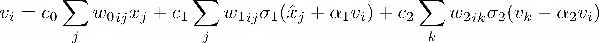
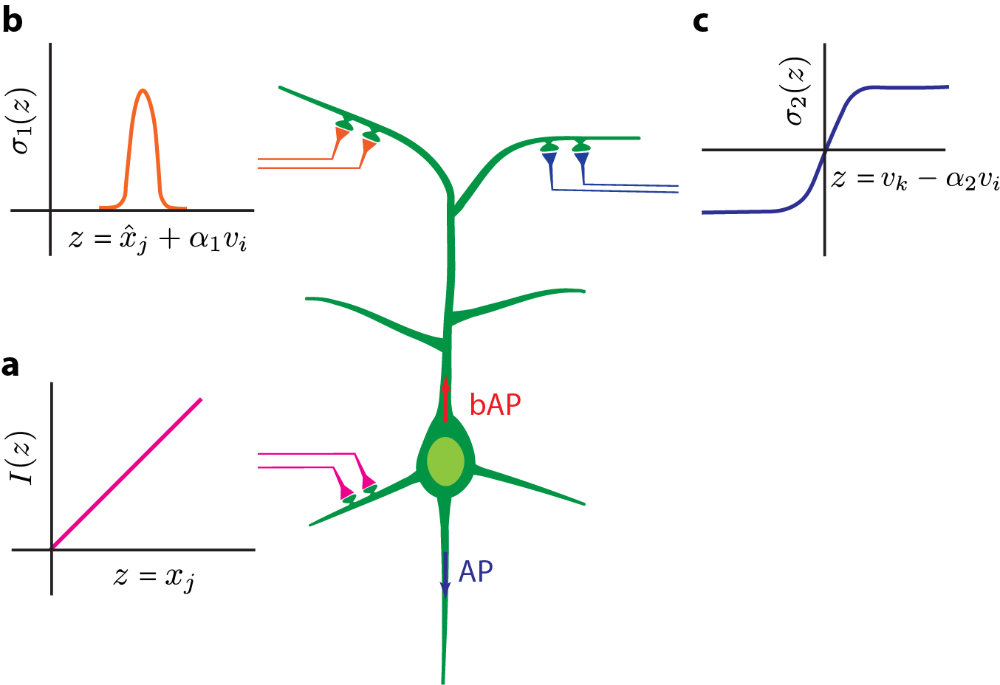

# A neural model for V1 that incorporates dendritic nonlinearities and back-propagating action potentials

The repository includes code that runs the simulations that reproduce the figures in [Rentzeperis, Ilias, Dario Prandi, and Marcelo Bertalmío. "A neural model for v1 that incorporates dendritic nonlinearities and back-propagating action potentials." bioRxiv (2024): 2024-09.](https://www.biorxiv.org/content/10.1101/2024.09.17.613420v1.abstract), currently under revision.

## A few words about the model 

We propose a model for V1 cells that can be considered an extension of the point neuron model, 
where in addition to a term corresponding to linear integration of inputs, as in the standard model, 
there are also two other terms corresponding to different types of dendritic nonlinearities, 
both including backpropagating action potentials (bAPs).

Our model equation of the membrane potential $v_i$ for cortical neuron $i$ is



where
$c_{\{0,1,2\}}$ are real values that scale the contribution of each of the three terms of the model, and
$w_{\{0,1,2\}}$ are weight matrices.

The first term in the equation represents the filtering operation performed by linear dendrites, $x_j$
 is the firing rate input elicited at position $j$. For no contribution from the nonlinear terms 
 ($c_1,c_2 = 0$), the model is reduced to the point neuron model with the linear filter $w_0$ 
 denoting the classical receptive field of simple cells (Fig. 1a).

 The second term represents the contribution of dendrites producing the XOR operation. When dendrites 
 of this type receive inputs from two pathways, they produce a high response only when one of these 
 pathways is active, i.e. the dendrites act as an XOR logical gate. In this term, $\hat{x}_j$ is the 
 membrane potential corresponding to $x_j$, $\alpha_1$ is a scalar coefficient that represents the 
 attenuation of the response ($v_i$) backpropagating from the soma to the dendrite, and 
 $\sigma_1$ is a dendritic nonlinearity of XOR type form (Fig. 1b).

The third term includes lateral interactions between cortical units within a nonlinearity, 
$\sigma_2$, that represents the contribution of sigmoidal-type dendrites. The inclusion of this term 
introduces a pool of different units that influence each other's activity. For unit $i$ interacting 
with unit $k$, the input within the sigmoid nonlinearity includes the response of unit $k$, $v_k$, 
that is subtracted from the attenuated, $\alpha_2$, backpropagating response of unit $i$,  $v_i$. 
The elements of $w_2$ indicate the strength of interactions between different units (Fig. 1c).




_Figure 1. Schematic of a neuron and the different ways of integrating the input modelled here_

## Getting Started

We create a virtual environment with```conda```. Other virtual environments will do as well. 

1. From the root directory, create a conda virtual environment (named neuronmodel here):  ```conda create -n neuronmodel```
2. Activate the environment:  ```conda activate neuronmodel```
3. Install pip: ```conda install pip```
4. Install the dependencies with pip: ```pip install -r requirements.txt```
5. Deactivate the virtual environment so that you use your base environment ```conda deactivate``` 
3. From your base environment create a jupyter kernel named after your virtual environment (you need to have ipykernel and jupyter installed before): ```python -m ipykernel install --user --name neuronmodel```

## Reproducing the figures of the paper
Each Jupyter notebook is associated with a separate experiment in the study that runs the model for the specific conditions saves the necessary variables, and subsequently loads them, and performs the necessary analysis to produce the associated Figures. There is an additional jupyter notebook, ```SpatialReceptiveField.ipynb``` that reproduces the figures related to the estimation of the receptive field from the model. Note that in certain cases, because of the random seeds, the Figures may slightly deviate from the ones shown in the paper, but the trend is the same.

Note that before running each jupyter notebook, you select from a dropdown the kernel associated with the virtual environment, ```neuronmodel``` if you named it such.

## System Requirements
Around 70 MB are needed for the reproduction of all the Figures, main and supplementary. 

## License
[MIT](https://opensource.org/license/mit/)
